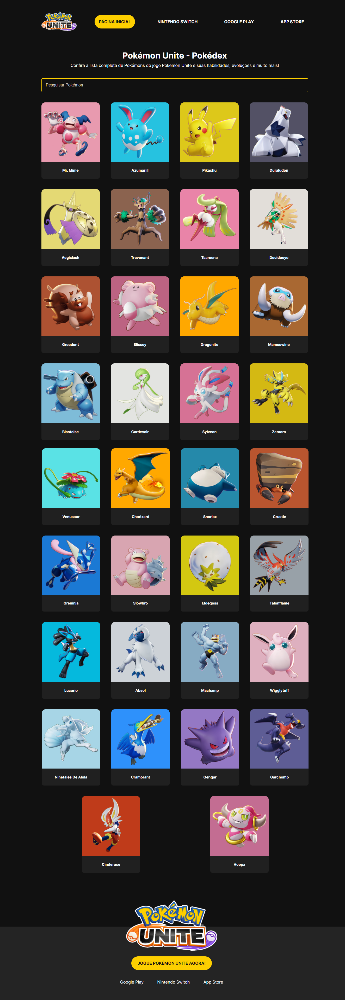

# Pokémon Unite - Pokédex

Bem-vindo à Pokédex do jogo Pokémon Unite! Este projeto foi desenvolvido para fornecer uma interface onde você pode explorar informações detalhadas sobre os Pokémon disponíveis no jogo.

## Visão Geral

 [Vizualizar](https://pokedex-beta-olive.vercel.app/)
<details>
  <summary>📸</summary>
  
  

</details>
O projeto consiste em um site simples com as seguintes funcionalidades principais:

- **Menu de Navegação**: Permite acessar diferentes partes do site e links externos para Nintendo Switch, Google Play e App Store.
  
- **Pesquisa de Pokémon**: Um campo de pesquisa para encontrar Pokémon específicos na Pokédex.
  
- **Cards de Pokémon**: Apresentação dinâmica de informações detalhadas de cada Pokémon, como habilidades e evoluções.

## Estrutura do Projeto

O projeto está estruturado da seguinte forma:

- **HTML**: Estrutura básica da página, definindo o layout e os elementos visíveis.
  
- **CSS**: Estilização dos elementos para melhorar a apresentação e usabilidade.
  
- **JavaScript**: Funcionalidades dinâmicas, como a busca por Pokémon e interações com o usuário.

## Como Contribuir

Se você deseja contribuir para este projeto, siga os passos abaixo:

1. Faça um fork deste repositório.
2. Crie uma branch para sua feature (`git checkout -b feature/sua-feature`).
3. Commit suas mudanças (`git commit -am 'Adiciona nova feature'`).
4. Faça um push para a branch (`git push origin feature/sua-feature`).
5. Crie um Pull Request.

## Como Executar o Projeto Localmente

Para executar o projeto localmente, siga estas instruções:

1. Clone o repositório:

   ```bash
   git clone https://github.com/seu-usuario/pokemon-unite-pokedex.git
